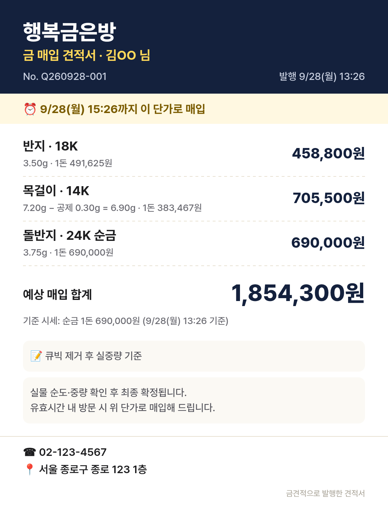

# 금견적 (gold-quote-card) — 금은방 카톡 매입 견적 카드

**라이브: https://geumgyeonjeok.netlify.app/**

금은방 사장님이 카톡으로 들어오는 "이거 팔면 얼마예요?" 문의에 **매장명·견적번호·발행 시각·유효시간·단가**가 찍힌 매입 견적 카드를 30초 안에 만들어 보내는 무설치·무로그인 웹앱입니다.



## 주요 기능
- 오늘 순금 1돈 매입가 입력 → 24K/22K/18K/14K 1돈 단가 자동 계산(함량 × 매장 적용률, 직접 입력 가능)
- 품목 여러 개, g/돈 단위 전환, 보석·큐빅 공제, 절사 단위, 유효시간
- 견적 카드 **PNG 이미지(1080px)** 공유/저장, 카톡 문구 복사, **서버 없이 여는 견적 링크**(`#q=` 인코딩, 전화·길찾기·카톡 버튼 포함)
- 견적 기록과 방문/매입완료 표시 → 방문율·성사율·성사 금액
- 백업 내보내기/불러오기, 예시 데이터 체험, 전용 버전 신청 폼(Netlify Forms, `?ref=` 유입 채널 기록)
- 모든 데이터는 브라우저 localStorage에만 저장(신청 폼 제외)

## 구조
```
index.html            # 단일 페이지(탭 4개 + 손님용 화면), Netlify Forms 정적 폼
styles.css            # 모바일 우선 스타일
app.js                # 로직(vanilla JS, 외부 라이브러리 없음)
manifest.webmanifest  # 홈 화면 설치
assets/icon.svg
netlify.toml          # 정적 배포 설정
tests/e2e.mjs         # Playwright E2E(데스크톱 1280 + 모바일 390)
docs/                 # 기획서·테스트베드·테스트보고서·완료보고서·스크린샷·결과 JSON
```

## 로컬 실행과 테스트
```bash
python3 -m http.server 8080          # http://localhost:8080
npm i -D playwright-core && npx playwright install chromium
BASE_URL=http://localhost:8080/ node tests/e2e.mjs
BASE_URL=https://geumgyeonjeok.netlify.app/ TAG=live node tests/e2e.mjs
```

## 문서
- [기획서](docs/기획서.md): 아이디어, 니치 시장, 페르소나, 문제 근거(출처), 경쟁, 기능
- [테스트베드](docs/테스트베드.md): 채널 선정, 14일 계획, 게시 문구, 성공 지표
- [테스트보고서](docs/테스트보고서.md): 38/38 PASS, 결함과 조치, 휴리스틱 점검, 스크린샷
- [완료보고서](docs/완료보고서.md): 링크, DoD 자체 검증표, 미결 사항

> 계산 보조 도구입니다. 최종 매입가는 매장이 실물의 순도·중량을 확인한 뒤 정합니다.
