# 테스트 보고서 — 금견적

> 대상: 라이브 URL **https://geumgyeonjeok.netlify.app/** (Netlify 배포)
> 최종 실행: 2026-09-28 13:26 KST · 결과 **38/38 PASS** (데스크톱 19 + 모바일 19)
> 원본 결과: [`docs/test-results-live.json`](test-results-live.json) · 로컬 사전 테스트: [`docs/test-results-local.json`](test-results-local.json) · 스크립트: [`tests/e2e.mjs`](../tests/e2e.mjs)

## 1. 무엇을 테스트했나 (범위)
| 구분 | 실시 여부 | 내용 |
|---|---|---|
| 기능 테스트(자동) | ✅ 실시 | Playwright로 주요 흐름 전체: 온보딩 → 설정 → 시세 → 견적 → 카드(이미지·문구·링크) → 손님용 화면 → 기록 → 신청 폼 → 백업 → 초기화 |
| 반응형·사용성 테스트(자동) | ✅ 실시 | 데스크톱 1280×860, 모바일 390×844(iPhone UA, 터치, DPR 2), 가로 넘침, 가려진 버튼, 콘솔 에러 |
| 휴리스틱 사용성 점검 | ✅ 실시 | 닐슨 10대 원칙 + "카톡 문의 → 견적 발송" 시나리오 워크스루(5장) |
| **시장 테스트(실사용자)** | ⏳ **미실시** | 외부 게시·연락 금지 조건에 따라 문구와 계획만 준비했습니다. 최 앨런 님이 게시하면 시작합니다([테스트베드.md](테스트베드.md)) |

## 2. 환경
- 도구: playwright-core 1.59.1, Google Chrome for Testing 153.0.8010.12 (headless), Node.js 20.19.2
- 로케일·시간대: ko-KR, Asia/Seoul · 클립보드 권한 허용(복사 내용을 실제로 읽어서 검증)
- 신청 폼(T14)은 **실제 전송 없이 모의 응답**으로 검증했습니다(사용자 Netlify에 테스트 데이터가 쌓이지 않도록). 대신 Netlify가 폼을 인식했는지는 Netlify MCP `get-forms-for-project`로 확인했습니다: 폼 `custom-request`, 필드 bot-field·ref·shop·contact·message, 허니팟 활성, 제출 0건.
- 라이브 정적 리소스 HTTP 상태(curl): `/`, `/app.js`, `/styles.css`, `/assets/icon.svg`, `/manifest.webmanifest` 모두 **200**

## 3. 결과 (라이브, 최종 실행)
| ID | 테스트 항목 | 데스크톱 1280 | 모바일 390 | 확인 내용/측정값 |
|---|---|---|---|---|
| T01 | 초기 로딩·온보딩 표시 | ✅ PASS | ✅ PASS | HTTP 200, title="금견적 · 금은방 카톡 매입 견적 카드" |
| T02 | 매장명 없이 카드 만들기 → 설정으로 안내 | ✅ PASS | ✅ PASS |  |
| T03 | 매장 설정 필수값 검증 및 저장 | ✅ PASS | ✅ PASS |  |
| T04 | 시세 입력 검증·저장·순도별 단가 계산 | ✅ PASS | ✅ PASS | 18K 491,625원, 14K 383,467원 |
| T05 | 적용률 변경·단가 직접 입력 반영 | ✅ PASS | ✅ PASS | 22K 90% → 569,457원, 직접입력 600,000원 확인 후 원복 |
| T06 | "오늘 얼마예요?" 단가 안내 문구 복사 | ✅ PASS | ✅ PASS | [행복금은방] 9/28(월) 13:25 기준 매입 단가 (1돈=3.75g) |
| T07 | 견적 작성: 필수값 검증 + 3개 품목 합계 | ✅ PASS | ✅ PASS | 합계 1,854,300원 |
| T08 | 공제 중량 > 총중량 오류 표시·삭제 버튼 | ✅ PASS | ✅ PASS |  |
| T09 | 견적 카드 만들기 → 미리보기 | ✅ PASS | ✅ PASS | Q260928-001 |
| T10 | 이미지 공유/저장 → PNG 생성 | ✅ PASS | ✅ PASS | 금견적-Q260928-001.png 1080x1408, 188KB |
| T11 | 카톡 문구 복사 | ✅ PASS | ✅ PASS | 15줄 |
| T12 | 견적 링크 → 손님용 화면 (새 브라우저, 저장 데이터 없음) | ✅ PASS | ✅ PASS | 링크 길이 744자 |
| T13 | 기록: 상태 변경·통계·새로고침 유지 | ✅ PASS | ✅ PASS |  |
| T14 | 전용 버전 신청 폼 (전송은 모의 응답) | ✅ PASS | ✅ PASS | POST 본문에 form-name=custom-request, ref=e2e-test(유입 채널) 포함 확인 |
| T15 | 백업 내보내기(JSON) | ✅ PASS | ✅ PASS | 금견적-백업-260928.json |
| T16 | 레이아웃: 모든 탭 가로 스크롤 없음 | ✅ PASS | ✅ PASS | 시세표 폭 606/606px |
| T17 | 전체 초기화 → 예시 데이터 체험 흐름 | ✅ PASS | ✅ PASS | 예시 합계 1,854,300원 |
| T18b | 조작 요소가 다른 레이어(호스팅 배지 등)에 가려지지 않음 | ✅ PASS | ✅ PASS | 8개 요소 elementFromPoint 확인 |
| T18 | 콘솔 에러 0건 | ✅ PASS | ✅ PASS |  |

**검증 기준값(수기 계산과 일치 확인)**: 순금 1돈 690,000원 기준
- 18K 1돈 단가 = ⌊690,000 × 0.75 × 0.95⌋ = 491,625원 → 반지 3.5g: 3.5/3.75 × 491,625 = 458,850 → 100원 절사 **458,800원**
- 14K 1돈 단가 = ⌊690,000 × 0.585 × 0.95⌋ = 383,467원 → 목걸이 7.2g − 공제 0.3g = 6.9g: 705,579 → **705,500원**
- 24K 돌반지 1돈 = **690,000원** → 합계 **1,854,300원** ✅
- (690,000원은 테스트용 가정값입니다. 실제 시세가 아닙니다.)

## 4. 발견한 결함과 조치 (수정 후 재검증 완료)
| # | 발견 시점 | 결함 | 원인 | 조치 | 재검증 |
|---|---|---|---|---|---|
| B1 | 라이브 1차 실행(10/36 PASS) | 모바일·데스크톱에서 하단 탭 **"기록·설정"과 우하단 버튼이 눌리지 않음** | Netlify 무료 플랜이 넣는 "Powered by Netlify" 배지 iframe(우하단 고정, 약 180×48px, 최상위 z-index)이 클릭을 가로챔. 로컬에서는 재현되지 않음 | 탭바를 **상단 고정**으로 옮기고, 하단 합계 바를 배지 위(bottom 68px)로 올림. 하단 여백 확보. 가려짐 자동 검사(T18b) 추가 | 라이브 38/38 PASS |
| B2 | 로컬 스크린샷 검토 | 모바일 390px에서 시세표 **"1돈 단가" 열이 잘림** | 5열 표가 너무 넓음 | '함량' 열을 순도 셀 아래 작은 글씨로 합치고 입력칸 폭 축소. 표 내부 넘침 자동 검사 추가(T16) | 표 폭 356/356px |
| B3 | 로컬 스크린샷 검토 | 토스트 알림이 하단 합계 바를 가림 | 위치 겹침 | 토스트를 상단(앱바 아래)으로 이동 | 스크린샷 확인 |
| B4 | 로컬 스크린샷 검토 | 손님용 링크 화면 상단에 "매장명을 설정하세요"가 보임 | 사장님용 문구 재사용 | 손님 화면에서는 "손님용 매입 견적서"로 표시 | T12 스크린샷 |

기타: 테스트 스크립트 자체 문제(초기화 버튼을 누르기 전에 설정 탭으로 이동하지 않음) 1건을 고쳤습니다. 앱 결함은 아닙니다.

## 5. 휴리스틱 사용성 점검 (닐슨 10대 원칙, 에이전트 자체 평가)
| 원칙 | 평가 | 근거/개선점 |
|---|---|---|
| 1. 시스템 상태 가시성 | 양호 | 상단에 오늘 시세 칩, 품목마다 실시간 금액, 저장·복사 토스트 |
| 2. 현실 세계와 일치 | 양호 | 업계 용어(돈, 18K/14K, 공제, 매입가), g↔돈 전환 |
| 3. 사용자 통제와 자유 | 보통 | 품목 삭제, 기록 삭제, 초기화 확인창. **되돌리기(undo)는 없음** |
| 4. 일관성과 표준 | 양호 | 주요 행동은 금색 버튼, 보조 행동은 테두리 버튼 |
| 5. 오류 예방 | 양호 | 이상 시세 차단, 공제 > 중량 경고, https 링크 검증, 매장명 필수 |
| 6. 기억보다 인식 | 양호 | 품목명 추천 목록, 마지막 순도 유지, 기본 유효시간 |
| 7. 유연성과 효율 | 보통 | 기존 사용자는 약 6번 조작으로 발송(아래). **자주 쓰는 품목 즐겨찾기는 없음** |
| 8. 미니멀 디자인 | 양호 | 탭 4개, 한 화면에 한 가지 일 |
| 9. 오류 인식·복구 | 양호 | 빨간 테두리와 문구, 해당 입력칸으로 포커스 이동 |
| 10. 도움말 | 보통 | 온보딩 3단계와 예시 데이터. 상세 도움말 페이지는 없음 |

### 시나리오 워크스루: "손님이 카톡으로 '18K 반지 3.5g 얼마예요?' 문의" (기존 사용자, 오늘 시세 입력 완료)
1. 앱 열기(홈 화면 아이콘) → 견적 탭이 기본 화면
2. 순도 선택(18K는 기본값이라 생략 가능)
3. 중량 칸 탭 → `3.5` 입력
4. (선택) 품목명 `반지`
5. "견적 카드 만들기" 탭
6. "이미지 공유/저장" 탭 → (모바일) 공유 시트에서 카카오톡 선택

→ **필수 조작 약 4~6번**(자동 테스트 T07·T09·T10 흐름 기준으로 센 값이며, 실제 사람 기준 소요 시간은 측정하지 않았습니다. "30초"는 목표치이고 시장 테스트에서 확인해야 합니다).

## 6. 스크린샷 (라이브에서 촬영)
| 화면 | 데스크톱 | 모바일 |
|---|---|---|
| 온보딩 | 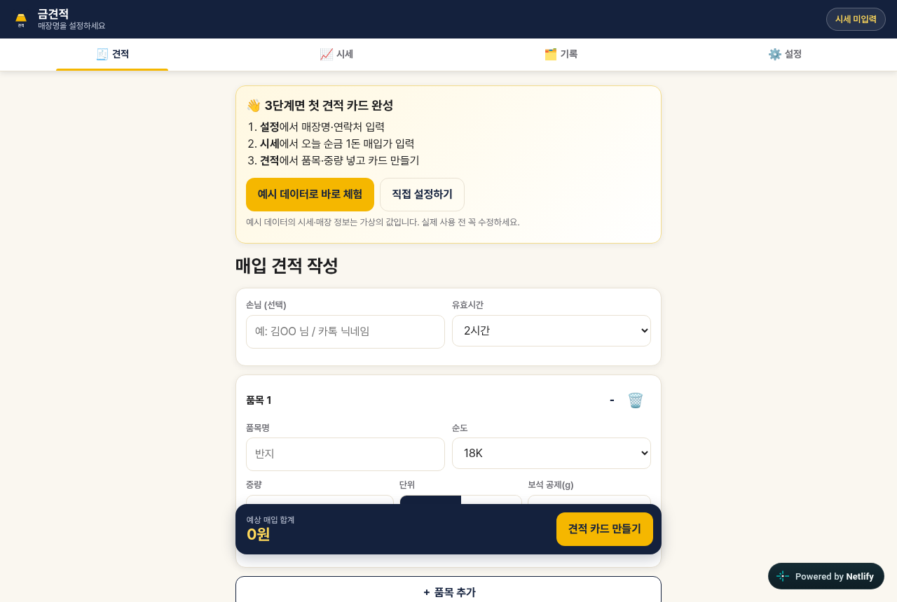 | 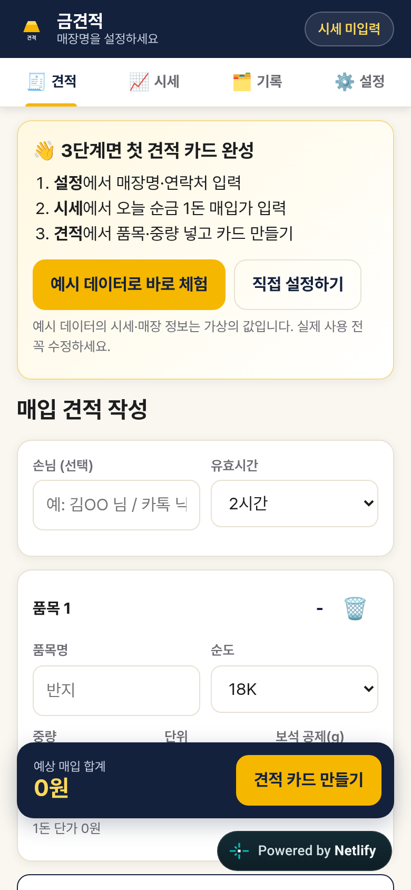 |
| 설정 | 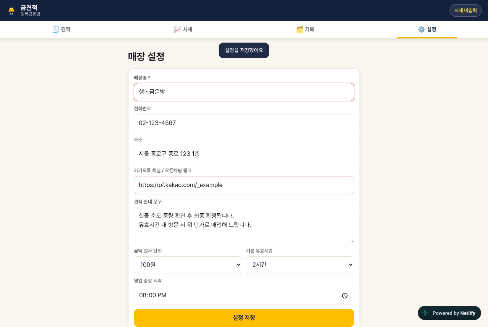 | 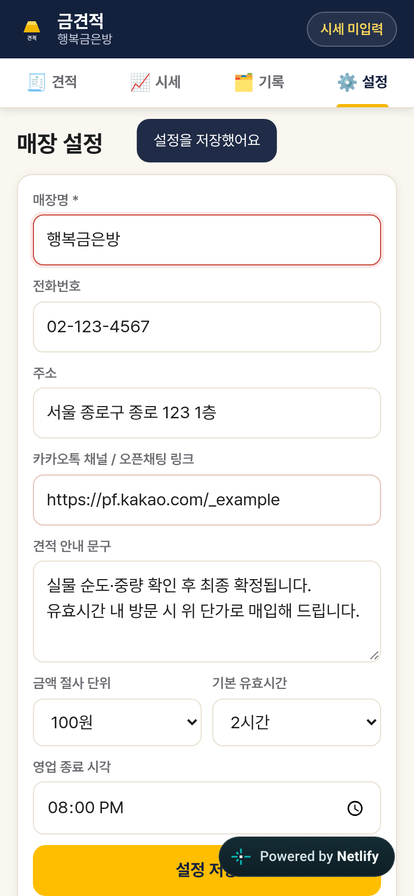 |
| 시세 | 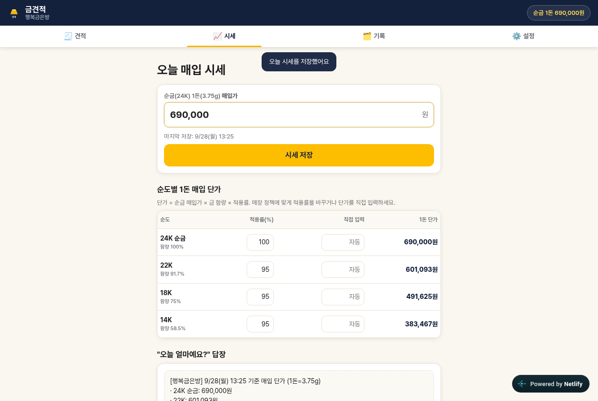 | 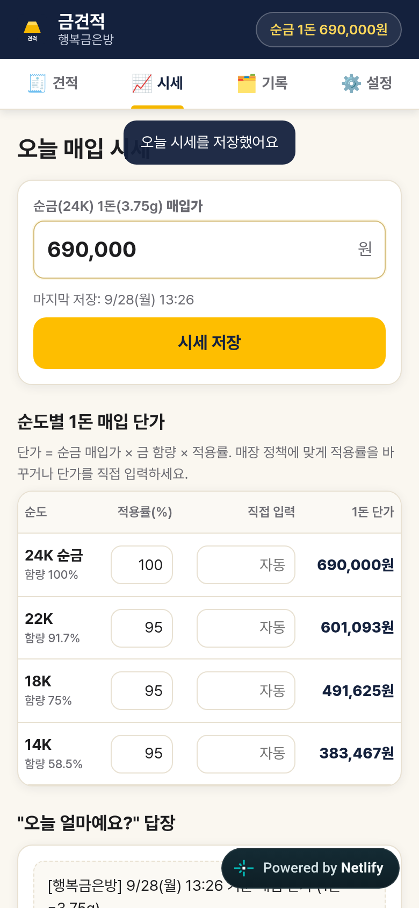 |
| 견적 작성 | 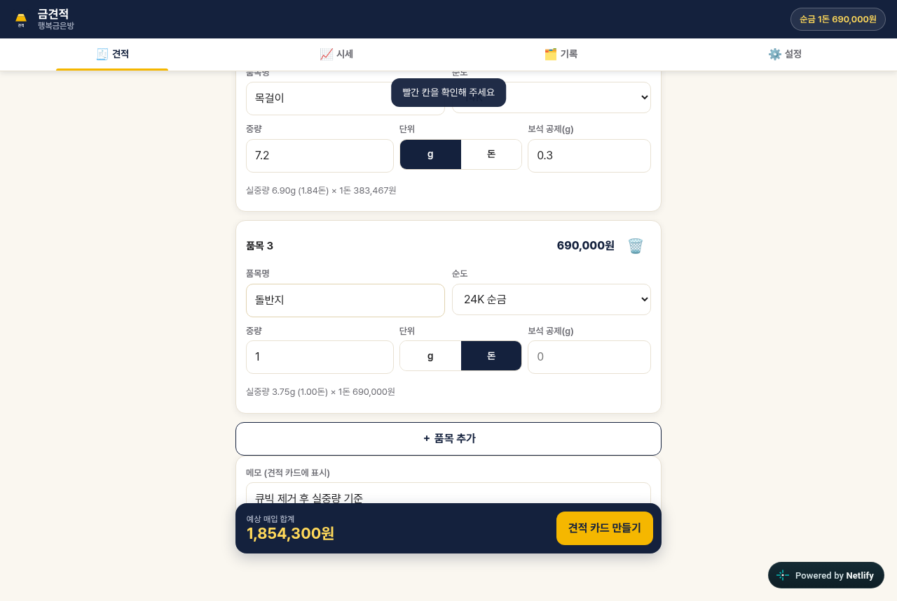 | 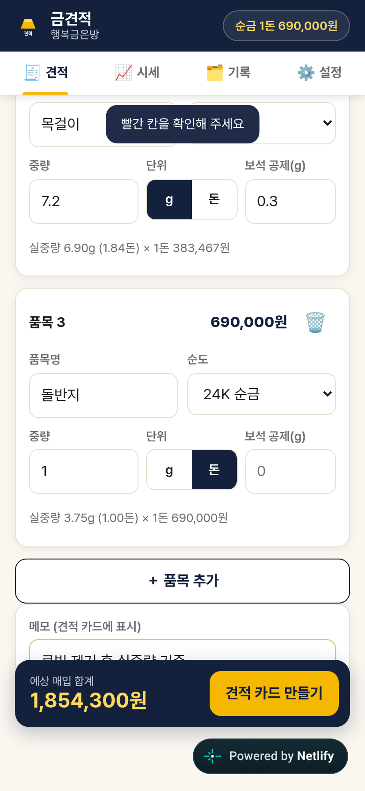 |
| 카드 미리보기 | 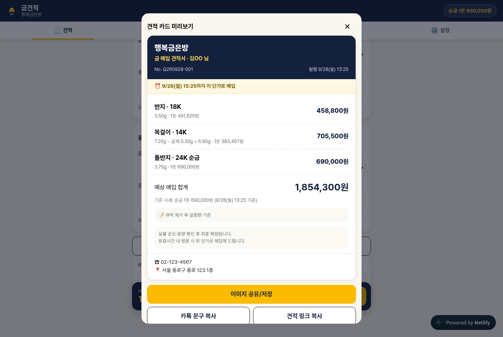 | 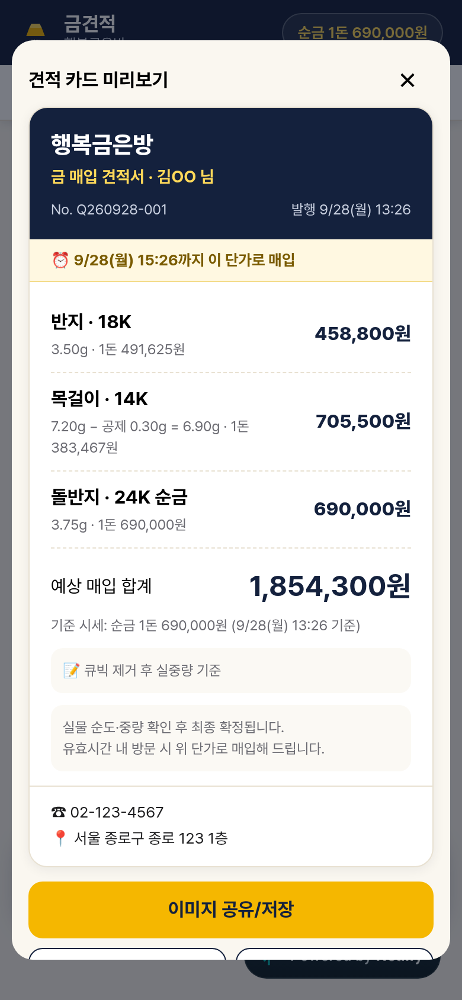 |
| 손님용 링크 화면 | 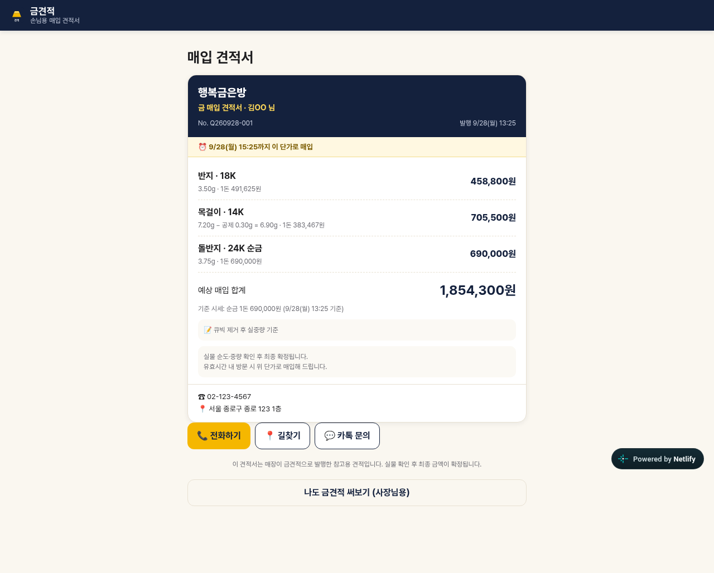 | 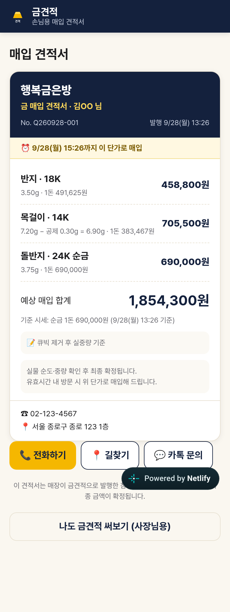 |
| 견적 기록 | 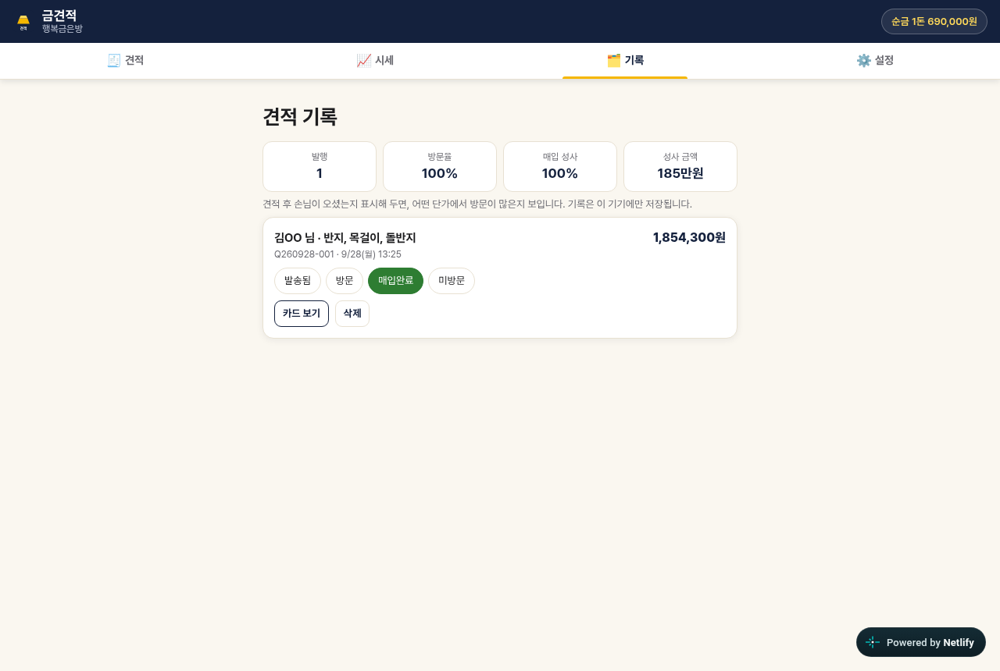 | 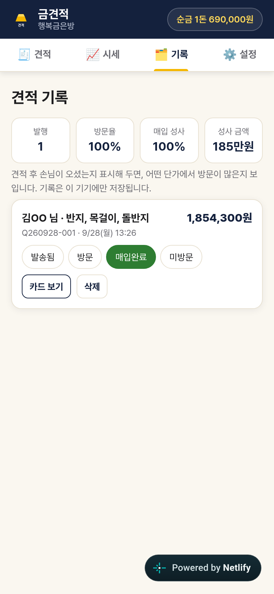 |
| 생성된 견적 이미지(PNG) | 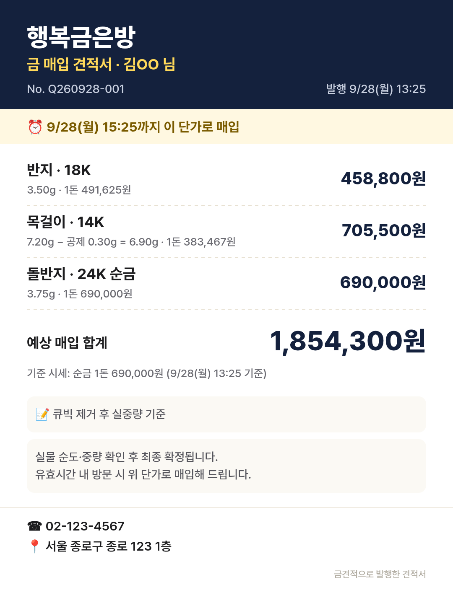 |  |

## 7. 한계 (테스트하지 못한 것)
- **실제 사용자 테스트 없음**: 시장 반응, 지불 의향, 실제 소요 시간은 미검증입니다.
- **실기기 미검증**: iOS Safari, 삼성 인터넷, **카카오톡 인앱 브라우저**에서의 공유 시트(`navigator.share` 파일 공유)와 클립보드 동작은 테스트하지 못했습니다. 헤드리스 Chromium은 파일 공유를 지원하지 않아 "다운로드 대체 경로"로만 검증했습니다.
- 신청 폼은 모의 응답으로만 검증했고, 실제 Netlify 제출은 하지 않았습니다(폼 인식 여부만 확인).
- 접근성은 기본(레이블, aria, 44px 터치 영역) 수준입니다. 스크린리더 실사용 점검은 하지 않았습니다.
